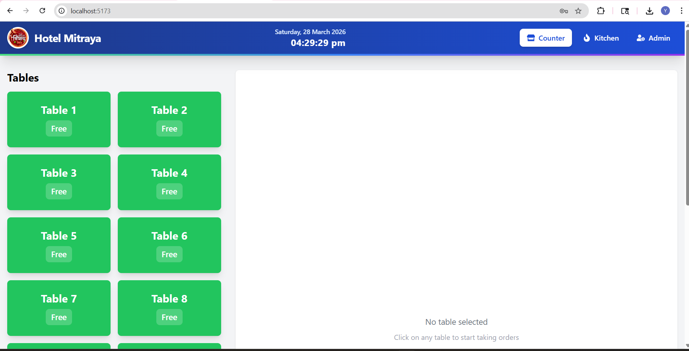
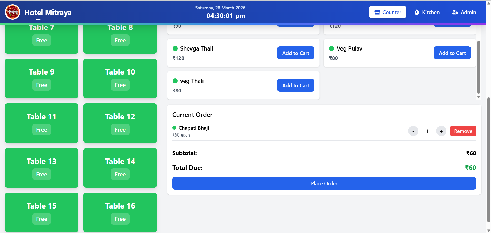
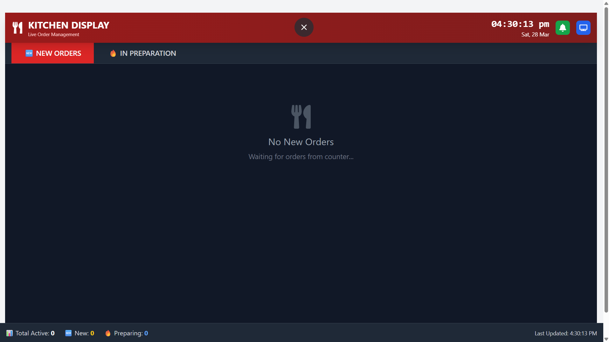
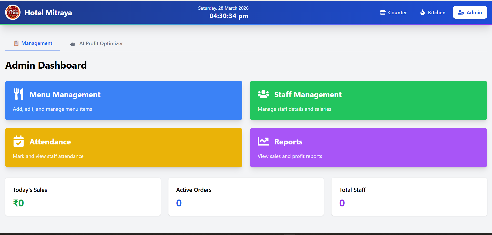
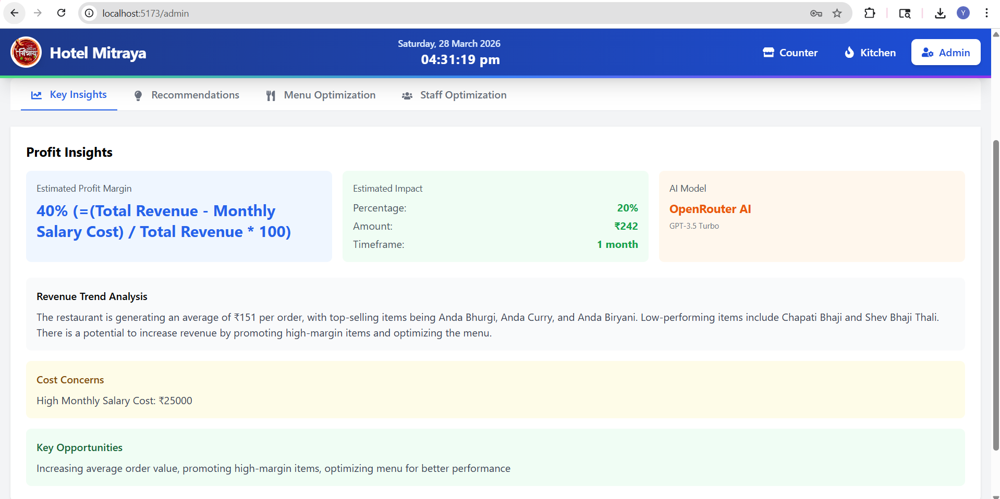
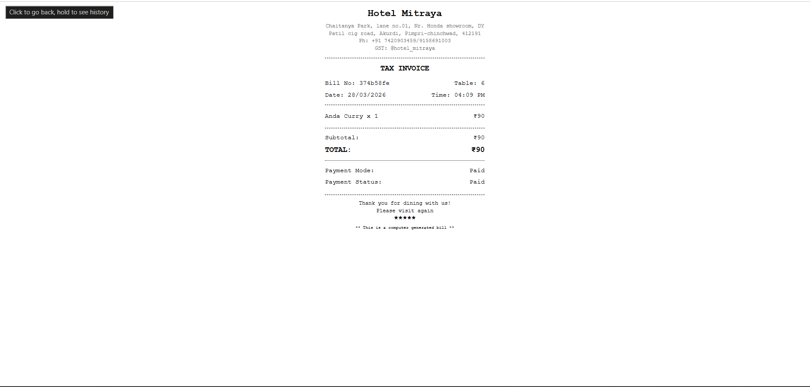

# 🍽️ Hotel Mitraya - Complete Restaurant Management System

[](LICENSE)
[](https://reactjs.org/)
[](https://nodejs.org/)
[](https://www.mongodb.com/)
[](https://tailwindcss.com/)
[](https://socket.io/)

A complete, production-ready Restaurant Management System built with the MERN stack (MongoDB, Express, React, Node.js) and Socket.io for real-time updates. Perfect for restaurants of all sizes.

## 📸 Screenshots

### Counter System

*Main counter interface with 16 table cards*

### Order Management

*Order management with menu items and cart*

### Kitchen Display

*Kitchen TV display for order management*

### Admin Dashboard

*Admin dashboard with AI insights*

### AI Profit Optimization

*AI-powered profit analysis and recommendations*

### Bill Printing

*Thermal bill printing interface*

## 📋 Table of Contents
- [Features](#-features)
- [Screenshots](#-screenshots)
- [Tech Stack](#-tech-stack)
- [Quick Start](#-quick-start)
- [Project Structure](#-project-structure)
- [API Endpoints](#-api-endpoints)
- [Bill Printing & Storage](#-bill-printing--storage)
- [AI Features](#-ai-features)
- [Keyboard Shortcuts](#-keyboard-shortcuts)
- [Database Schema](#-database-schema)
- [Deployment](#-deployment)
- [Troubleshooting](#-troubleshooting)
- [License](#-license)

## ✨ Features

### 🏪 Counter System
- **16 Interactive Table Cards** with color-coded status (Free, Occupied, Preparing, Ready to Serve, Served, Eating, Paid)
- **Quick Order Management** with search and filter
- **Multiple Customer Orders** per table support
- **Parcel Option** with automatic ₹10 charge
- **Prepaid System** - Full or partial prepayment support
- **One-Click Checkout** - Automatically saves and prints thermal bills
- **Real-time Bill Generation** with print-ready format

### 🍳 Kitchen Display System
- **Dedicated TV Screen Mode** - Full-screen optimized for kitchen monitors
- **Real-time Order Updates** via Socket.io
- **Large Readable Cards** visible from distance
- **Status Management** - New Orders → Preparing → Ready to Serve
- **Order Age Tracking** with urgency indicators
- **Sound Notifications** for new orders
- **Touch-Friendly Buttons** for easy operation

### 👨‍💼 Admin Dashboard
- **Passkey Protection** (PIN: 5555)
- **Menu Management** - Add, edit, delete, toggle availability
- **Veg/Non-Veg Categories** with color coding
- **Staff Management** with salary tracking
- **Attendance System** with daily marking
- **Automated Salary Calculation** - monthlySalary - (absentDays × perDayDeduction)
- **Reports & Analytics** - Daily, monthly, and profit reports

### 🤖 AI-Powered Profit Optimization
- **OpenRouter AI Integration** for intelligent insights
- **Real-time Profit Analysis** based on sales data
- **Actionable Recommendations** for improvement
- **Menu Optimization Strategies**
- **Staff Efficiency Suggestions**
- **Estimated Profit Impact** calculations

### 💰 Billing System
- **Thermal Printer Support** - 80mm receipt format
- **Automatic Bill Saving** - Date-wise organized storage
- **Single Click Checkout** - Print and save simultaneously
- **Indian Rupee Currency** (₹) formatting
- **Bill Preview** before checkout

### 📊 Reports & Analytics
- **Daily Sales Reports** with item-wise breakdown
- **Monthly Sales Analysis** with trends
- **Profit Reports** with margin calculations
- **Top Selling Items** identification
- **Payment Type Analytics** - Paid vs Unpaid

## 🛠️ Tech Stack

### Frontend
| Technology | Version | Purpose |
|------------|---------|---------|
| React.js | 18.2.0 | UI Framework |
| Vite | 4.4.5 | Build Tool |
| Tailwind CSS | 3.3.3 | Styling |
| React Router | 6.15.0 | Navigation |
| Socket.io-client | 4.7.2 | Real-time updates |
| Axios | 1.5.0 | API calls |
| React Hot Toast | 2.4.1 | Notifications |
| React Icons | 4.11.0 | Icons |
| date-fns | 2.30.0 | Date formatting |

### Backend
| Technology | Version | Purpose |
|------------|---------|---------|
| Node.js | 14+ | Runtime |
| Express | 4.18.2 | Web Framework |
| MongoDB | 5.0+ | Database |
| Mongoose | 7.5.0 | ODM |
| Socket.io | 4.7.2 | WebSocket |
| OpenRouter AI | - | AI Integration |
| dotenv | 16.3.1 | Environment Variables |
| cors | 2.8.5 | CORS Handling |

## 🚀 Quick Start

### Prerequisites
- Node.js (v14 or higher)
- MongoDB (local or Atlas)
- npm or yarn package manager
- Thermal printer (optional)

### Installation Steps

#### 1. Clone the Repository
```bash
git clone https://github.com/yashn555/hotel-mitraya.git
cd hotel-mitraya
```

#### 2. Backend Setup
```bash
cd backend
npm install
cp .env.example .env
```

Edit .env file:
```env
PORT=5000
MONGODB_URI=mongodb://localhost:27017/hotel_mitraya
NODE_ENV=development
OPENROUTER_API_KEY=your_openrouter_api_key_here
```

Start backend:
```bash
npm run dev
# Server runs on http://localhost:5000
```

#### 3. Frontend Setup
```bash
cd frontend
npm install
npm run dev
# Frontend runs on http://localhost:5173
```

#### 4. Database Setup
Make sure MongoDB is running:
```bash
mongod
```

#### 5. Access the Application
- Counter System: http://localhost:5173/
- Kitchen Display: http://localhost:5173/kitchen
- Kitchen TV Mode: http://localhost:5173/kitchen-display
- Admin Dashboard: http://localhost:5173/admin

## ⌨️ Keyboard Shortcuts

### Counter Screen
| Key | Action |
|-----|--------|
| SPACE | Toggle quick add mode |
| 1-9 | Quick add items (when in quick mode) |
| Ctrl + Enter | Place/Update order |
| Delete | Clear entire cart |
| Esc | Close current table |

### Kitchen Display
| Key | Action |
|-----|--------|
| F11 | Fullscreen mode |
| Ctrl + R | Refresh display |

## 📝 License

This project is licensed under the MIT License - see the LICENSE file for details.

## 👨‍🍳 Author
Hotel Mitraya Management System

## 🙏 Acknowledgments
- React team for amazing framework
- MongoDB for flexible database
- Tailwind CSS for utility-first CSS
- OpenRouter for AI capabilities
- All contributors and testers

## 📞 Support & Contact
For support, issues, or questions:

📧 Email: yashnagapure35@gmail.com

🐛 GitHub Issues: Create an issue

## ⭐ Features Roadmap

### Planned Features
- Online ordering system
- Mobile app for customers
- Inventory management
- Supplier management
- Advanced analytics dashboard
- Email/SMS notifications
- Multiple restaurant support
- Customer loyalty program
- QR code ordering
- Kitchen order printing
- WhatsApp integration
- GST billing support

## 📊 Version History
- v1.0.0 (Current) - Initial release with core features
- v1.1.0 - Added AI integration and thermal printing
- v1.2.0 - Added kitchen display and bill storage
- v2.0.0 - Planned major update with online ordering

---

### Made with ❤️ for Hotel Mitraya
### Happy Managing! 🍽️
